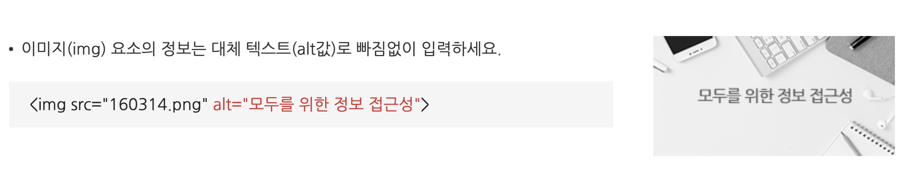
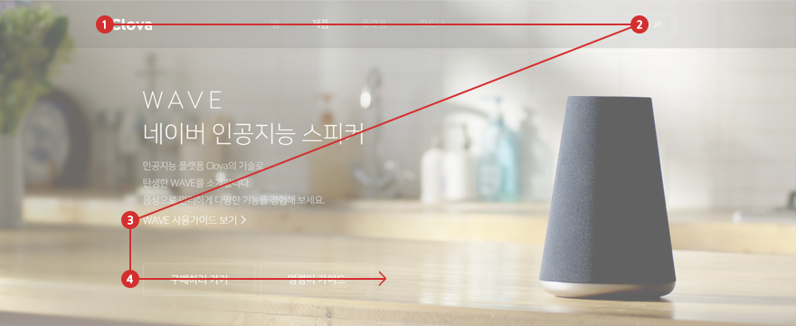

> ### 웹 접근성이란?

 <br>

Web 접근성은 「지능정보화기본법」에 따라 장애인이나 고령자분들이 웹 사이트에서 제공하는 정보를 비장애인과 동등하게 접근하고 이용 할 수 있도록 보장하는 것으로 웹 접근성 준수는 법적의무사항 입니다. (출처 : 한국웹접근성인증평가원)

$\rightarrow$ **한 마디로, 좋은 웹 서비스를 모두가 자유롭고 편하게 사용할 수 있게 하는 것!**

<hr>

> ### 접근성을 위한 개발은 어떤 것들이 있을까??

<br>

### 웹 접근성의 4가지 요소

  <br>

- 인식의 용이성 : 모든 콘텐츠는 사용자가 인식 가능해야한다.

  - 대체 텍스트 : img태그 내의 alt에 대체 텍스트를 입력해 스크린리더기가 읽을 수 있게 해야한다. 버튼도 alt를 통해 기능을 명시해야한다.

    
    <br>

- 운용의 용이성 : 사용자가 모든 기능에 대해 조작이 가능해야한다.

  - 사용자의 키보드에 있는 Tab 키를 이용해 콘텐츠를 자유롭게 이용할 수 있게 한다. tabindex속성을 이용한다.
    

- 이해의 용이성 : 모든 사용자에게 콘텐츠는 이해돼야한다.

  - input, textarea, select 요소에 1:1 대응하는 label 요소 또는 title 속성을 제공해야한다

  ```
  <dl>
  <dt><label for="pwd">기존비밀번호 입력</label></dt>
  <dd><input type="password" id="pwd"/></dd>
  <dt><label for="newPwd">새비밀번호 입력</label></dt>
  <dd><input type="password" id="newPwd" /></dd>
  <dt><label for="pwdConfirm">비밀번호 입력 확인</label></dt>
  <dd><input type="password" id="pwdConfirm"/></dd>
  </dl>
  ```

- 견고성 : 미래의 기술로도 현재의 콘텐츠를 이용할 수 있어야 한다.

<hr>

> ### 웹 접근성을 위한 개발을 꼭 해야 할까?

- 유튜브에서 시각장애인 유튜버가 운영하는 '원샷한솔'이라는 채널을 종종 보는데, 비장애인들이 시각장애인에 대해 궁금해하는 여러 점들에 대해 답해준다. 그 중 "시각장애인은 핸드폰을 어떻게 사용하나요? 유튜브 댓글은 어떻게 읽나요?"라는 질문에 보이스오버, 초점 이동과 같은 기능을 이용해 다양한 웹, 앱 서비스를 사용하는 영상을 본 적이 있다.

- 해당 영상을 통해 웹 접근성을 처음 접하게 되었고, 모든 사람이 어려움 없이 좋은 IT 서비스를 누리려면 웹 접근성을 위한 개발은 필수라는 생각을 하게 되었다. 또한 개발을 공부하는 사람으로 웹 접근성이라는 것을 항상 염두에 염두에 두고, 웹 접근성과 관련된 기능 구현도 빼먹지 않고 공부를 해야겠다고 다짐했다.

- 서비스 관점에서도 웹 접근성을 잘 준수한 코드는 SEO에 유리하여 검색 엔진 검색 결과로 잡히기에 유리하다고 한다. 웹 접근성이 단순히 사용성 측면뿐 아니라 어떠한 유저도 놓치지 않을 수 있다는 점 또한 상당히 매력적이라고 느꼈다.

<hr>
<br>

## 출처

- https://accessibility.naver.com/accessibility
- http://www.wa.or.kr/m1/sub1.asp
- https://eunyoe.tistory.com/75
- https://maxkim-j.github.io/posts/web-accessiblity-virtuous-cycle

```

```

```

```
