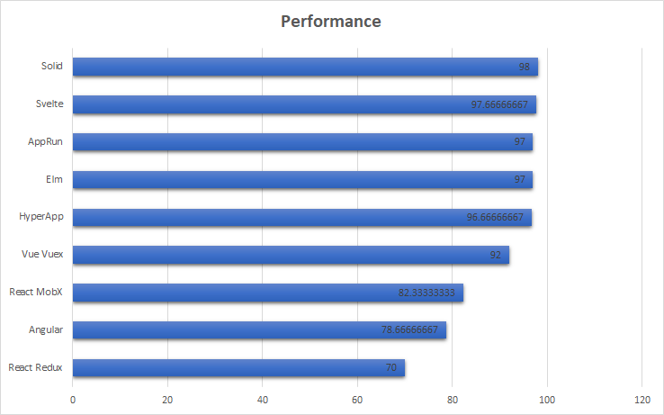

## 라이브러리, 프레임워크 톺아보기

### React

- 페이스북에서 지원하는 라이브러리
- virtual Dom을 지원한다
- SPA(Single Page Application) 방식으로 진행한다면 검색엔진 노출(SEO : Search Engine Optimization)에 관련된 문제를 생각 했을 때 SSR을 염두해 둘 수 밖에 없었는데 Next.js로 해결 가능
- 자바스크립트 확장 문법인 JSX를 통해 컴포넌트 단위로 UI를 구성할 수 있다.

### Angualr

- 구글에서 지원하는 typeScript 기반 프레임워크
- 양방향 바인딩을 사용한다.
- 학습 난이도가 높다.
- 사용법이 정형화되어 있어 다른 라이브러리와의 혼용이 어려울 수 있다.

### Vue

- 오픈소스 자바스크립트 프레임워크
- typeScript를 Vue.js / React보다 효과적으로 지원한다.
- Angular의 양방향 바인딩, React의 Virtual DOM 렌더링 방식 모두를 가지고 있다.
- 낮은 학습 난이도가 장점이다.
- 후발주자이기에 Angular / React에 비해 생태계 규모가 작다

### Svelte

- 컴파일러
- React에 비해 가볍고 코드의 양을 줄일 수 있다.
- virtual Dom을 사용하지 않는다
- StackOverflow의 2021년 설문조사 결과, 개발자에게 가장 사랑받는 프론트엔드 프레임워크로 선정되었다.
- React, Angular, Vue에 비하면 정보가 많이 없고 커뮤니티가 작은 편이다.
- 내부에 Store를 제공함으로써, 변경된 상태 값을 DOM에 빠르게 반영할 수 있도록 기능을 제공한다.

---

## 스타트업을 창업한다고 할 때, 무슨 라이브러리/프레임워크를 사용해야 할까?

 

- 스타트업의 경우 빠르게 MVP 형태의 프로덕트를 구현하고, 유저의 반응을 본 후, 그에 대한 피드백 사항을 빠르게 반영해야합니다.
  그렇기에 가장 보편화되어있는 React를 사용하는 것이 스타트업 운영과 성장을 위해 가장 효과적일 것이라고 생각합니다.

- 또한 스타트업의 경우에는 개발자를 구하지 못하는 경우도 왕왕 발생합니다. 그러한 상황에서 Svelte와 같이 아직은 정보가 없고 커뮤니티가 작은 기술을 잘 다루는 개발자를 찾는 것은 정말 어려울 것입니다.

---

## 난 무엇을 위해 React 를 학습하는가?

 

프론트엔드 개발에 발을 들인지 3개월 정도가 되어가는 웹린이로서, 제가 리액트를 학습하게 된 계기는 당연히 "가장 많은 사람이 쓴다"는 점이었습니다.

UX에 큰 관심이 있는터라, 기획자가 아닌 개발자로 UX를 어떻게 개선할 수 있을까를 자주 생각해봅니다.

그때마다 결국 가장 효과적일 수 있는 사용성 개선의 방법은 반응성을 개선하는 것이 아닐까 싶습니다.

 

요즘 웹 사이트들의 경우 처리하는 정보가 많다보니 로딩 시간이 길어질 수 있는데, 로딩 시간이 길어지면 이는 사용자 이탈로 이어집니다.

따라서 로딩 시간을 줄이고 반응성을 개선하는 것은 유저의 이탈을 방지하기 위해 핵심적인 역할을 하게 됩니다.

Pinterest는 서비스 이용 고객 중 단 1%만이 가입을 진행했을만큼 굉장히 느린 속도였지만, 해당 문제의 심각성을 깨닫고 문제를 해결해 5분 이상 이용하는 사용자가 40%가 늘었고 이로 인한 광고 수익은 44%가 늘어나는 엄청난 결과를 이뤄냈다고 합니다.

그렇기에 저는 반응성이 좋고 가볍다는 Svelte를 언젠가 사용해보고 싶다는 생각이 듭니다.

 

상단 그래프를 보면 Svelte가 React, Angular, Vue를 성능으로 이기는 것을 볼 수 있습니다.

하지만 아무래도 아직 커뮤니티가 작고 정보가 없는 Svelte이기에 가장 큰 커뮤니티를 가지고 있고, 또 가장 많이 쓰이고 있는 리액트에 대한 실력곽 경험을 쌓은 후 좋은 기회가 된다면 Svelte를 사용해 좋은 반응성을 가진 웹 서비스를 구현해보고 싶습니다.

---

### 참고 자료

https://kim1124.tistory.com/60
https://pusha.tistory.com/entry/Angular-React-Vue-%EB%AC%B4%EC%97%87%EC%9D%B4-%EB%8B%A4%EB%A5%B8%EA%B0%80
