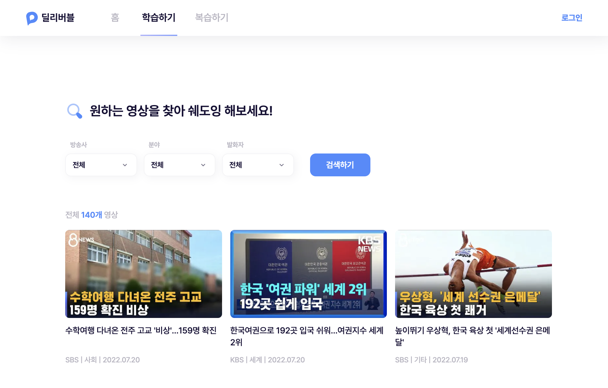
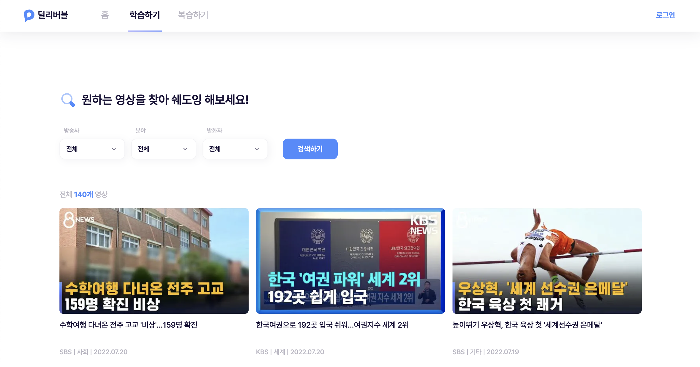
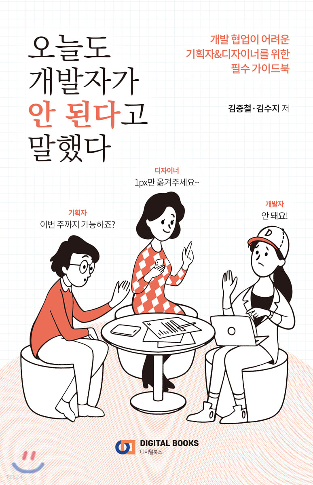
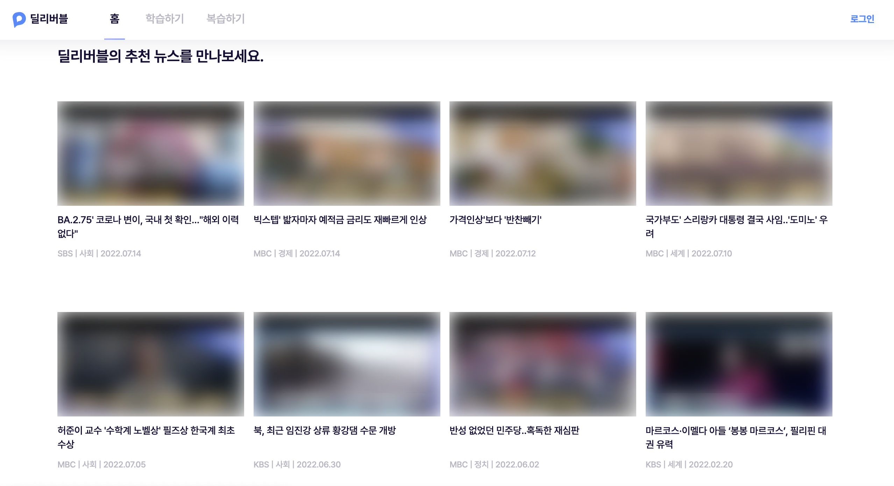

## **협업하고 싶은 기획자와 개발자는 어떤 사람일까?**

 

> 들어가며

 

나는 지난 30기 앱잼팀 **딜리버블**에서 아나운서 쉐도잉으로 스피치 연습을 하는 서비스를 기획하는 PM을 맡았다.

기획자로서의 첫 프로젝트였기에 많은 시행착오와 실수가 있었고, 그 경험을 통해 느낀 **협업하고 싶은 기획자와 개발자는 어떤 사람인지**에 대해 몇 가지 "썰"과 함께 이야기를 해보려 한다.

초보 기획자였던 나의 개인적인 경험에서 나온 글이기에, 미숙한 점 혹은 다른 의견이 언제나 존재할 수 있으니 그 점을 감안하고 글을 읽어주기를 바란다.

 

---

### **1. 상세한 로직을 꼼꼼하게 전달하는 기획자**

 

개발자는 기획자가 전달한 와이어프레임과 기능명세서, 화면 설계서 등의 기획 문서를 보고 개발에 들어간다.

하지만 이러한 기획 문서는 아쉽게도 한 가지 한계점이 있다.

바로 **정적**이라는 것이다.

 

하지만 개발자는 **동적**인 것을 구현한다.

웹, 또는 앱 서비스에는 다양한 동적인 기능이 들어간다.

조건 검색을 위한 드롭다운 또는 어떤 버튼을 클릭했을 때 등장하는 애니메이션이나 모달을 원한다.

 

딜리버블에서 기획팀에서 '드롭다운 사건'이라고 불리는 하나의 이슈를 예로 들어보겠다.

기획팀에서는 다양한 조건에 따라 유저가 원하는 뉴스 영상을 찾을 수 있도록 하는 드롭다운 구현을 개발자에게 요구했다.
이에 따라 PM들은 이에 대한 와이어프레임, 화면 설계서, 기능명세서를 모두 공들여 작성한 후 전달했다.
 

하지만 초보기획자였던 우리는 드롭다운이 어떠한 모양으로 보일 것인지, 어떠한 카테고리가 들어갈 것인지 등의 정적인 부분에만 집중하다 동적인 로직 정리를 놓쳐버렸다.

 

드롭다운은 생각보다 복잡한 로직을 가진 기능이었다.

    1. 전체 버튼을 클릭했을 때 모든 카테고리에 체크가 되어야하는지
    2. 전체가 체크된 상태에서 하나의 카테고리를 선택했을 때 나머지 카테고리들의 체크가 모두 해제되어야하는지
    3. 하나의 드롭다운을 펴면 다른 하나의 드롭다운은 닫혀야하는지
    4. 바깥 영역을 클릭했을 때 드롭다운이 자동으로 닫혀야하는지
    5. 현재 작업하고 있는 드롭다운의 border를 어떤 색깔로 표시할 것인지

이 외에도 적지 않은 부분에 대한 결정이 필요한 기능이 바로 드롭다운이었다.

초보 기획자였던 나는 이러한 부분에 대해 고려를 하지 못했고, 개발자가 그때그때 궁금한 로직을 물어보며 작업을 해야했다.

 

또한 해당 과정에서 이렇게 복잡한 로직에 대한 서로 다른 이해 때문에 다음과 같은 드롭다운이 완성되었다.

    1.'전체'를 클릭하면 모든 카테고리가 체크된다.
    2. 이 상태에서 '사회' 카테고리를 선택하면 '사회' 카테고리만 체크가 해제된다.

즉, 유저가 원하지 않는 카테고리의 선택을 해제하는 식으로 원하는 카테고리를 추려가야하는 요상한 드롭다운이 된 것이다.

 

그제서야 PM들은 사태의 심각성을 인지하고 웹 사이트들을 돌아다니며 드롭다운 레퍼런스를 수집하여 상세한 로직을 전달하였다.

개발자가 그동안 해온 개발을 한 번 다시 갈아엎으며 불필요한 리소스를 투입한 이후에야 비로소 원하던 드롭다운을 만날 수 있었다.

 

이 과정을 통해 깨달은 다음과 같다.

아무리 잘 짠 기획문서라도 동적인 로직을 모두 보여주기에는 분명히 한계가 존재한다.
그 한계를 보완하기 위해서 기획자는 정적인 기획 문서를 작성하더라도 동적인 로직을 잘 전달할 수 있는 방법을 계속적으로 고려해야한다고 느꼈다.

 

우리 팀의 경우 이른바 '드롭다운 사건'을 겪고 나서는 동적 로직을 전달할 때 마치 수도코드를 적는 것 마냥

> if(''전체''가 선택됨) '전체' 앞에 있는 체크박스만 체크가 됨

이런 식으로 문장을 써서 로직을 전달하기도 했다.

 

협업에서는 리소스를 낭비하지 않고 적절한 곳에 잘 투입하는 것이 핵심이라고 생각한다.
기획자의 상세하고 꼼꼼한 동적 로직 정리는 이러한 리소스 관리에 큰 도움이 될 것이라고 생각한다.

 

---

### **2. 무조건 안된다는 말보다는 대안을 제시하는 개발자**

 

> 기획자 : 제가 기획한 서비스의 핵심 기능에는 푸시 알림과~   개발자 : 네? 푸시 알림은 힘들 것 같은데...

 

내가 기획 아이디어를 디벨롭하고 피드백을 받으면서 가장 두려웠던 것은 개발자의 "그 기능은 힘들 것 같은데..."라는 말이었다.

비단 나만 그랬을 것이라고 생각하지 않는다.

앱잼을 준비하며 협업을 위해 읽었던 책이

였으니.

 

웹 개발을 공부하면서 그때 나에게 "그 기능은 힘들 것 같은데..."라고 말했던 개발자들의 마음을 비로소 조금이나마 이해할 수 있게 되었지만, 기획자에게는 실로 절망스러운 순간이 아닐 수 없다.

PM이 본인이 해결하고 싶은 문제를 해결할 수 있는 핵심적인 기능이 개발자가 개발을 하기 너무나 어려운 기능일 수 있고, 또는 주어진 시간 내에 완성을 하기가 어려운 기능일 수 있다.

 

이런 상황은 특히나 대학생 프로젝트 팀에서는 필연적으로 마주할 상황일 수 밖에 없다.
그렇기에 그런 상황에서 어떻게 하면 프로젝트의 전체적인 방향에 큰 영향을 주지 않으면서 기획자가 해결하고 싶은 문제를 충분히 잘 해결할 수 있을까?

 

내 경험에 의한 답은

> **"대안을 제시하자"**

이다.

 

딜리버블은 랜딩페이지에 꽤나 힘을 준 서비스다.

로티도 들어가고, 왓챠의 랜딩페이지처럼 버튼을 누르면 밑으로 하나씩 페이지가 이동하기도 하고, 전체 배경이 흰색과 파란색이 섞인 그라데이션이라 내용이 잘 보이게 하기 위해서는 투명한 Nav바의 배경색이 투명으로 바뀌기도 한다.

그렇기에 랜딩페이지를 담당한 개발자가 개발을 진행하면서 디자이너와 소통해야할 부분도 적지 않아 처음 계획한 것보다 일정이 밀리기도 했고, 서비스의 메인 기능인 학습 기능을 구현하는 시간을 고려했을 때 랜딩페이지 개발에 긴 시간을 쏟을 수는 없었다.

 

하지만 레퍼런스가 특별히 없었던 우리 서비스 특성상 우리 서비스를 소개하는 랜딩페이지는 꽤나 중요한 역할을 하고 있었기에 PM들은 리소스 투입에 대해 큰 고민을 가지고 있었다.

그때 마침 개발자가 좋은 대안을 주었다.

 

> 랜딩페이지 페이지가 부드럽게 넘어가는 게 아니라 그냥 싹! 넘거가도 되는 거면 완성을 할 수 있을 것 같은데 혹시 이렇게 대체하는 것은 어때?

 

이 덕분에 우리는 기획 의도에서 크게 벗어나지 않은 랜딩페이지를 완성할 수 있었다.

기획자가 제시한 기능에 대해 그건 불가능할 것 같다고 직접적으로 말하지 않고, 위와 같이 다른 대체할 수 있는, 조금 더 가능성이 있는 해결책을 말해준다면 기획자는 이를 고려하여 리소스를 효율적으로 사용하면서도, 기획 의도를 지킬 수 있는 가장 합리적인 선택을 할 수 있게 된다.

 

---

### **3. UX는 결국 모두의 일이라는 것을 이해하는 기획자와 개발자**

 

 

UX를 빼고 서비스를 논할 수는 없을 것이다.
기획자들은 좋은 UX를 만들기 위해 수십번 와이어프레임을 고치고 레퍼런스를 찾기 위해 수백개의 서비스를 찾아본다.

하지만 설계를 했을 때, 그리고 실제로 그것이 구현되어 나왔을 때 기획자들이 생각한 그 느낌이 아닌 경우가 적잖이 발생하는 것을 경험했다.

 

딜리버블에는 메모 기능이 있고, 그 메모를 수정하고 삭제할 수 있다.

초보기획자였던 나는 메모를 수정하거나 삭제할 때 모달이 떠야한다는 점을 고려하지 못했고, 모달을 제외한 메모 기능 자체에 대해서만 기획 문서를 전달했다.

메모 기능을 구현하던 개발자가 본인이 개발을 하고 사용을 해보니 무언가 어색한 점이 발견됐다며 PM들을 불러 모달을 추가하는 것은 어떻냐고 의견을 물어왔다.

 

프론트엔드 개발자는 자연스럽게 자신이 개발하고 있는 서비스의 첫 사용자가 된다.

첫 사용자의 입장에서 본인이 구현한 해당 기능의 사용성에 대해 주는 적절한 피드백과 문제 제기는 서비스의 UX에 큰 도움이 된다.

또한 사용성이 불편한 기능에 대한 이슈를 최대한 빠르게 해결할 수 있게 된다.

우리 팀의 메모 기능의 UX를 개선하면서 만족스웠던 것은 개발자가 기능 구현에서 멈추지 않고 사용성에 대한 피드백을 적극적으로 준다는 것, 그리고 기획자와 디자이너도 개발자의 의견을 메이커이자 첫 사용자의 의견으로 여겨 적극적으로 수용했다는 것이었다.

 

다른 개발자는 본격 구현 전부터 뉴스 영상과 썸네일을 렌더링해야하는 딜리버블의 서비스 특성상 렌더링을 마칠 때까지 필요한 시간이 있을 것으로 예상이 되니, 유저를 위해 스켈레톤 뷰를 추가하자는 의견을 주기도 했었다.

 

스켈레톤 뷰와 같은 부분은 개발의 결과를 예측할 수 있는 개발자가 기획자보다 더 잘 고려할 수 있는 UX의 요소일 것이다.

이 과정에서 나는 좋은 UX는 개발자, 디자이너, 기획자가 모두 함께 만들어가는 것이라는 것을 배웠다.

그리고 그것을 처음부터 알고 있는 기획자, 디자이너, 개발자가 모인다면 리소스는 더욱 더 효율적으로 사용될 수 있을 것이다.

 

---

> 마무리

하나의 서비스는 당연하게도 혼자 만들지 못한다.

그렇다면 여러 사람이 모인다고 무조건 좋은 서비스가 되는 것은 또 아니다.

여러 명이 모여 가진 리소스를 최대한으로 효율적으로 사용할 수 있을 떄 비로소 좋은 서비스가 될 수 있다.

이를 위해 한 번 즈음은 내가 협업하고 싶은 개발자/디자이너/기획자가 되려면 어떤 사람이 되어야할까? 어떤 마인드셋을 지녀야할까?에 대해 생각해보는 것이 필요할 것이라고 생각한다.
