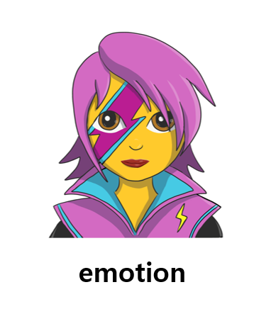
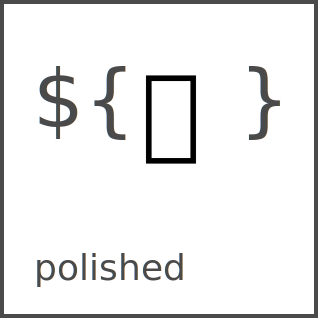

## Styled-Components

<br>

### **들어가며**

<br>


우리가 Vanilla JS로 웹 어플리케이션을 만들 때를 생각해봅시다.
html, css, js 파일을 모두 별도로 관리하죠.

하지만 React, Angular, Vue 같은 라이브러리가 인기를 얻으면서 이런 방식보다는 웹 어플리케이션을 재활용이 가능한 여러 개의 컴포넌트로 구분을 하고, 그 컴포넌트에 html, css, JS를 몽땅 적용하는 방식이 인기를 얻기 시작했습니다.

React에서 컴포넌트에 html을 넣는 건 JSX로 손쉽게 가능하죠?
CSS는 그러면 어떨까요?
스타일 정의를 CSS 파일이 아닌 JavaScript로 작성된 컴포넌트에 바로 삽입하는 CSS-in-JS 형식의 라이브러리만 있다면 css를 컴포넌트에 적용하는 것도 쉽게 가능해집니다.

그런 CSS-in-JS 형식의 라이브러리 중 최근 가장 큰 인기를 얻고 있는


**Styled-Components**에 대해 이야기해볼게요.

<br>

### **Styled-Components의 장/단점**

<br>

#### **👍🏻장점👍🏻**

<br>

- 자유로운 CSS 커스텀 컴포넌트를 만들 수 있습니다.

```
//header의 CSS 커스텀 컴포넌트

const Title = styled.header`
  display: flex;
  justify-content: center;

  margin: 20px;

  font-size: 28px;
`;
```

- 스스로 className을 랜덤으로 중복이 되지 않게 생성해주어서 className의 중복이나 오타로 인한 에러를 피할 수 있어요.

- 모든 스타일 속성이 특정 컴포넌트와 연결되어 있기 때문에 만약 컴포넌트를 삭제할 경우 이에 대한 스타일 속성도 함께 삭제되어 관리가 용이합니다.

- JavaScript와 CSS 사이의 상수와 함수를 쉽게 공유 할 수 있습니다. React에서는 props를 활용한 조건부 스타일링이 가능해요.

```
//props로 들어온 색깔이 있다면 해당 색깔을, 들어온 색깔이 없다면 파란색으로 배경색을 지정해요

background-color: ${props => props.color || "blue"};
```

<br>

#### **👎🏻단점👎🏻**

<br>

제가 styled-components를 사용하면서 느낀 가장 큰 단점은 다음과 같습니다.

- css를 줄 태그는 다 컴포넌트로 만들어야 합니다. 이 부분이 불필요한 컴포넌트를 만들게 하거나, 코드의 가독성을 떨어뜨릴 수 있다고 생각합니다.

이 외에는

- 별도의 라이브러리를 설치해야 하므로 CSS 파일을 따로 관리하는 방법에 비해 번들의 크기가 커집니다.

- 인터랙션한 페이지일 경우 CSS 파일을 따로 관리하는 방법에 비해 성능이 좋지 않을 수 있고, FOUC 현상이 발생할 수 있습니다.
  > **FOUC(Flash of unstyled content)** : 외부의 CSS가 불러와지기 전에 잠시 스타일이 적용되지 않은 웹 페이지가 나타나는 현상

이러한 현상은 CSS를 **SSR**(서버사이드 렌더링) 방식으로 넣어주는 등의 방식으로 보완할 수도 있어요.

<br>

### Styled-Components를 대체할 수 있는 라이브러리

<br>

**Emotion**

 <br>

- **SSR**(서버 사이드 렌더링)을 위한 별도의 설정이 필요하지 않습니다.
  styled-components의 경우 ServerStyleSheet 설정이 별도로 필요해요.

- **css props** : css 속성을 이용하면 인라인으로 작성을 해서 태그 이름을 바꾸지 않고도 스타일을 적용할 수 있어요.
  재사용을 하지 않을 태그에 스타일을 적용할 때 용이할 것으로 보입니다.

```
	<div
      css={{
        backgroundColor: 'tomato',
        '&:hover': {
          color: 'yellow',
        },
      }}
    >
```

**Stitches.js**

 <br>

- near-zero runtime을 표방하고 있습니다. runtime을 아예 가지지 않는 것은 아니지만, 최소화하는 방향의 API를 제공합니다.
- styled-components에서는 props에 의한 동적 스타일링이 가능하지만, stitches는 사전에 정의한 variants에 의한 스타일링만 가능합니다.

```
/* 🤓 stitches */
const Button = styled('button', {

  variants: {
    color: {
      violet: {
        backgroundColor: 'blueviolet',
      },
      gray: {
        backgroundColor: 'gainsboro',
      },
    },
  },
});

// color="#9542f5" 불가능
() => <Button color="violet">Button</Button>;

```

**polished**

 <br>

- styled-components팀에서 개발한 Sass-style 함수들과 mixins 함수들 모음입니다.
- CSS-in-JS와 inline styles에서 모두 사용할 수 있어요.
- saturation, lightness, opacify 등의 mixin 함수를 이용하면 디테일하게 색상을 바꿀 수 있습니다.
  <br>

### **마무리**

<br>

> **나는 Styled-Components를 쓰겠다!**

- 항상 개발을 하며 클래스 명을 어떻게 쓸지 고민하는데, 그 과정이 없어서 사용하기 편하다고 느꼈습니다.
- 컴포넌트를 생성함과 동시에 스타일을 줄 수 있는 방법이 편하게 느껴졌고, 특히나 버튼 컴포넌트와 같은 경우에는 재사용이 굉장히 용이했습니다.
- 많은 리액트 프로젝트들을 찾아보았을 때 Styled-Components를 이용한 것을 볼 수 있었습니다. <br>
  $\rightarrow$ 현재 가장 인기가 많은 CSS-in-JS 라이브러리라는 점도 협업을 할 때 무시할 수 없을 것 같습니다.

---

#### 참고자료

https://react.vlpt.us/styling/03-styled-components.html
https://www.daleseo.com/react-styled-components/
https://velog.io/@bepyan/styled-components-%EA%B3%BC-emotion-%EB%8F%84%EB%8C%80%EC%B2%B4-%EC%B0%A8%EC%9D%B4%EA%B0%80-%EB%AD%94%EA%B0%80
https://velog.velcdn.com/images/heather128/post/f441a7c3-b426-4c76-bc6a-19afe881c39d/image.png
https://velog.io/@bepyan/styled-components-%EA%B3%BC-emotion-%EB%8F%84%EB%8C%80%EC%B2%B4-%EC%B0%A8%EC%9D%B4%EA%B0%80-%EB%AD%94%EA%B0%80
https://so-so.dev/web/css-in-js-whats-the-defference/
